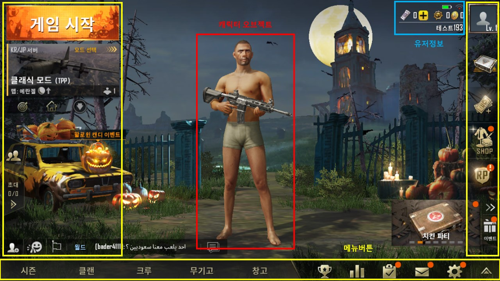

# 정의
  ## 용도
  - 게이머가 최초로 게임에 진입해 원하는 항목으로 이동할 수 있도록 함
  
  ## 기대효과
  - 자신의 캐릭터의 상태를 나타냄
  - 게임의 여러가지 기능 항목들을 배열 및 제공
 
 

# 구성도

 
 

# 인터페이스 페이지 세부요소
  ## 배경이미지 (element-01)
    - 화면의 배경에 삽입해 바탕을 이루는 이미지
    - 현재는 할로윈 시즌이므로 할로윈 분위기에 맞는 배경이미지를 삽입
  ## 배경 풀 오브젝트 (element-02)
    - 배경의 풀을 나타내는 오브젝트
    - 바람에 따라 조금씩 흔들리는 3D 오브젝트
  ## 캐릭터 오브젝트 (element-03)
    - 플레이어의 캐릭터를 나타내는 오브젝트
    - 몸을 조금씩 흔들고 있는 3D 오브젝트
  ## 유저정보 (element-04)
    - 유저에 대한 정보를 알려주는 텍스트
    - 보유캐시, 보유골드, 닉네임, 레벨, 아이콘 등을 보여줌
  ## 메뉴버튼 (element-05~23)
    - 원하는 각 항목으로 이동할 수 있는 버튼
    - 버튼을 터치하면 해당 항목으로 이동함

  ### 화면좌측 (인게임 관련)
  세부요소번호 | 버튼명칭 | 이동위치
  -------|------|------
  element-05 | 게임시작 | 선택한 모드의 게임 플레이 화면으로 이동
  element-06 | 모드선택 | 모드 선택화면으로 이동
  element-07 | 친구 | 친구관리 화면으로 이동
  element-08 | 초대 | 초대관리 화면으로 이동
  element-09 | 파티모집(깃발) | 파티모집 화면으로 이동
  element-10 | 채팅 | 채팅화면으로 이동

  ### 화면 하단1 (개인 설정 관련)
  세부요소번호 | 버튼명칭 | 이동위치
  -------|------|-----
  element-11 | 시즌 | 시즌정보화면으로 이동
  element-12 | 클랜 | 클랜관리화면으로 이동
  element-13 | 크루 | 크루관리화면으로 이동
  element-14 | 무기고 | 무기고화면으로 이동
  element-15 | 창고 | 창고화면으로 이동

  ### 화면 하단2 (기타 기능 관련)

  세부요소번호 | 버튼명칭 | 이동위치
  -------|------|-----
  element-16 | 랭킹 | 랭킹화면으로 이동
  element-17 | 미션 | 미션화면으로 이동
  element-18 | 메일 | 메일화면으로 이동
  element-19 | 설정 | 설정화면으로 이동

  ### 화면 우측 (정보 및 결제 관련)
  세부요소번호 | 버튼명칭 | 이동위치
  -------|------|-----
  element-20 | 정보 | 개인정보화면으로 이동
  element-21 | 충전 | 캐시충전화면으로 이동
  element-22 | SHOP | 상점화면으로 이동
  element-23 | 이벤트 | 이벤트화면으로 이동
 
 

# 기능흐름
  - 게임시작
    - 메인화면 등장
  - 메뉴버튼 터치
    - 터치한 메뉴버튼에 해당하는 화면으로 이동