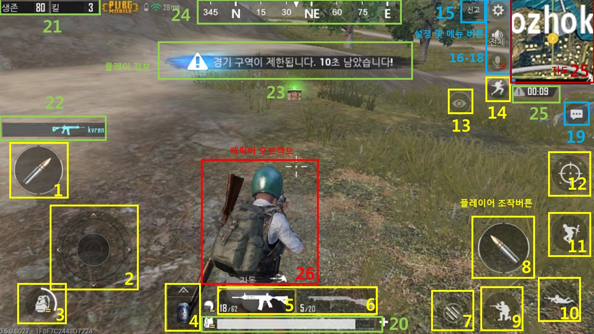
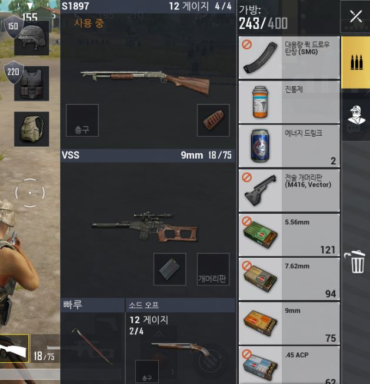
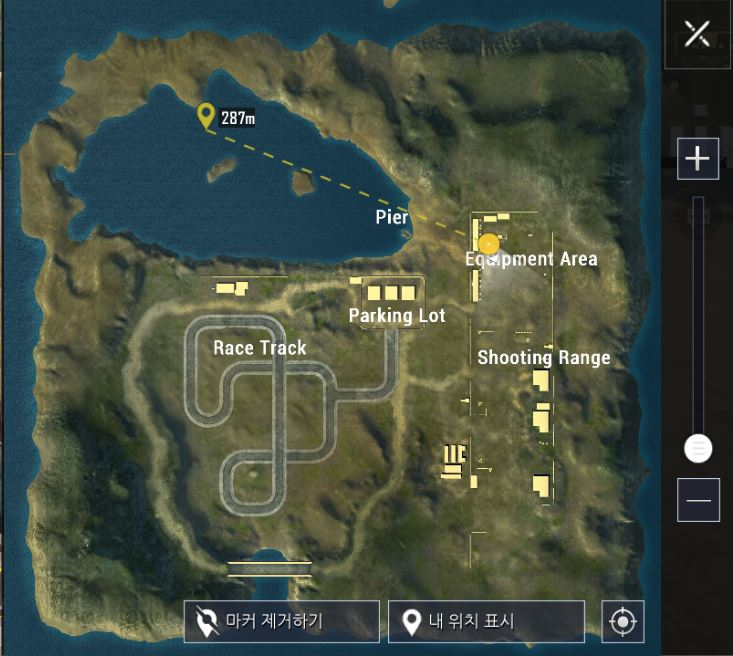

# 정의
  ## 용도
  - 게이머가 실제로 게임을 플레이하는 화면

  ## 기대효과
  - 플레이어 캐릭터가 적과의 전투에 필요한 동작들을 수행하도록 조작 가능
  - 게임 플레이 관련 정보를 제공해 줌으로서 더 효과적인 전투 가능
  - 그 외 추가적인 설정들을 제공해줌으로서 더 편리한 게임플레이 가능
 
 

# 구성도

 
 

# 인터페이스 페이지 세부요소
  ## 플레이어 조작버튼 (element-01~14)
    - 플레이어 캐릭터를 조작하는데 사용되는 버튼들

  세부요소번호 | 버튼명칭 | 이동위치
  -------|------|------
  element-01 | 공격(왼손) | 현재 무기로 공격
  element-02 | 이동 | 플레이어 캐릭터를 해당 방향으로 이동
  element-03 | 가방 | 가방 화면을 오픈
  element-04 | 회복약 | 선택된 회복약을 사용
  element-05 | 무기1 | 현재 무기를 무기1로 설정
  element-06 | 무기2 | 현재 무기를 무기2로 설정
  element-07 | 재장전 | 무기를 재장전
  element-08 | 공격(오른손) | 현재 무기로 공격
  element-09 | 앉기 | 플레이어 캐릭터가 앉음
  element-10 | 눕기 | 플레이어 캐릭터가 누음
  element-11 | 점프 | 플레이어 캐릭터가 점프
  element-12 | 시점전환 | 시점을 1인칭(3인칭)으로 전환
  element-13 | 자유시점 | 더 빠르게 주변시점 전환가능
  element-14 | 달리기 | 플레이어 캐릭터가 달림

  ### 가방화면
  
  - 현재 착용중인 장비를 보여줌
  - 현재 소지중인 아이템들을 보여줌
  - 착용장비를 소지한 아이템중 원하는 장비로 교체가능
  - 원하는 아이템을 버릴 수 있음

  ## 설정 및 메뉴 버튼 (element-15~19)
    - 게임 플레이 설정 팝업을 띄워주는 버튼
    - 버튼을 터치하면 팝업을 띄움
  세부요소번호 | 버튼명칭 | 이동위치
  -------|------|------
  element-15 | 신고 | 신고하기 팝업을 띄움
  element-16 | 설정 | 설정화면으로 이동
  element-17 | 스피커설정 | 전체, 팀원만 들리게 스피커설정
  element-18 | 마이크설정 | 전체, 팀원만 들리게 마이크설정
  element-19 | 채팅 | 채팅창 팝업을 띄움

  ## 게임플레이 정보 (element-20~25)
    - 게임에 대한 정보를 알려주는 요소
    - 체력, 생존자수, 킬수, 킬로그, 알림메시지 등을 보여줌
  세부요소번호 | 버튼명칭 | 이동위치
  -------|------|------
  element-20 | 플레이어 체력 | 플레이어의 현재 체력을 보여줌
  element-21 | 생존자수 및 킬수 | 생존자수 및 킬수를 보여줌
  element-22 | 킬로그 | 게임내 발생한 킬을 보여줌
  element-23 | 알림메시지 | 게임내 안내메시지를 보여줌
  element-24 | 방위 | 현재 보고있는 방향의 방위를 알려줌
  element-25 | 남은시간 | 다음자기장까지 남은시간을 보여줌
  ## 지도 (element-26)
    - 플레이어의 현재위치 주변의 지도를 보여주는 요소
    - 터치하면 지도화면을 띄워줌
  ### 지도화면
  
  - 우측의 + -버튼으로 지도 확대, 축소 가능
  - 지도위를 클릭하면 클릭한 위치에 마커 생성
  - 마커 제거하기 버튼으로 지도위의 마커 제거 가능
  - 내 위치 표시 버튼으로 마커를 현재 내 위치에 생성
  - 현위치 버튼으로 현재 보이는 지도의 중심을 내 위치로 설정

  ## 캐릭터 오브젝트 (element-27)
    - 플레이어의 캐릭터를 나타내는 오브젝트
    - 플레이어 조작 버튼을 이용해 조작가능
  ## 그 외 오브젝트 (element-28~)
    - 플레이어 캐릭터를 제외한 인게임을 구성하는 모든 3D오브젝트 들
    - 다른 플레이어 캐릭터, 맵, 바위, 풀, 차량 등

 
 

# 기능흐름
  - 플레이어 조작버튼 터치
    - 해당 버튼의 기능대로 플레이어 캐릭터가 동작
  - 설정 및 메뉴버튼 터치
    - 해당 버튼에 해당하는 팝업이 뜸
  - 지도 터치
    - 지도화면을 띄움
  - 가방 터치
    - 가방화면을 띄움
