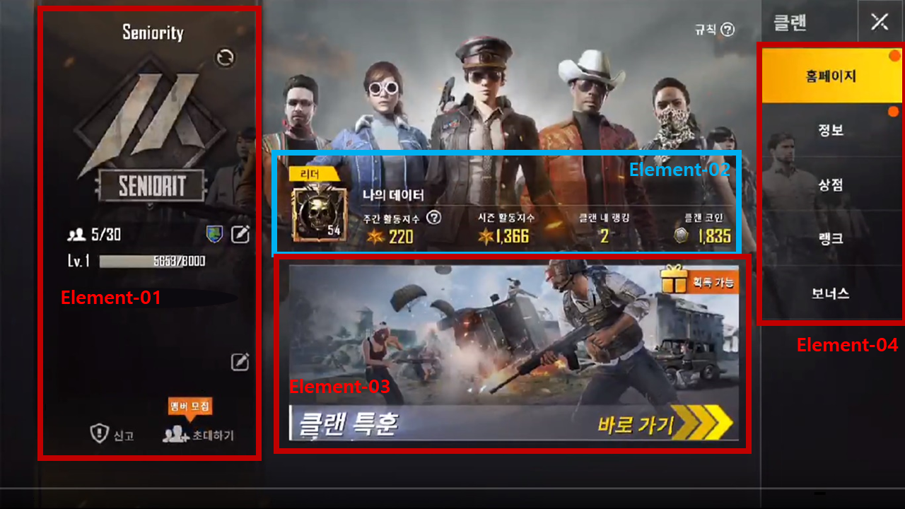

# 정의
  ## 용도
  - 클랜에 가입하거나 새 클랜을 생성하는 기능을 제공
  - 클랜 활동은 기본적으로 플레이어가 5Lv이 되었을 때부터 가능함

  ## 기대효과
  - 클랜원과 같이 클랜 특훈, 랭크 등의 서비스를 이용 가능
  - 얻은 클랜 코인으로 상점을 이용 가능
  - 클랜 레벨이 상승할수록 최대 수용 인원이 증가하는 시스템이 있음
 
 

# 구성도

 
 

# 인터페이스 페이지 세부요소
  ## 배경이미지 (Element-00)
    - 다양한 캐릭터가 서있는 모습의 일러스트
    - 뒤쪽에서 햇빛이 비추는 모습
  ## 클랜 정보 창 (Element-01)
    - 상단에는 클랜명과 클랜 레벨, 클랜 인원이 위치
    - 하단에는 클랜 신고와 클랜원 초대 기능이 있음
  ## 개인 정보 창 (Element-02)
    - 클랜에서 활동한 플레이어의 정보가 제공됨
  ## 클랜 특훈 (Element-03)
    - 클랜의 특수한 기능인 클랜 특훈을 할 수 있는 버튼임
    - 클랜 특훈을 통해 클랜 코인을 얻을 수 있고 이를 상점 등에서 활용할 수 있음
  ## 화면 선택 버튼 (Element-04)
    - 메인화면과 정보, 상점, 랭크, 보너스의 화면을 선택할 수 있는 버튼

 
 

# 기능흐름
  - 신고 버튼
    - 해당 클랜을 신고할 수 있음
  - 초대하기
    - 닉네임 입력을 통해 플레이어를 클랜원으로 초대할 수 있음
  - 클랜 특훈
    - 클랜 특훈을 할 수 있도록 이동 가능
    - 특훈의 보상으로 클랜 상점을 이용 가능한 시스템
