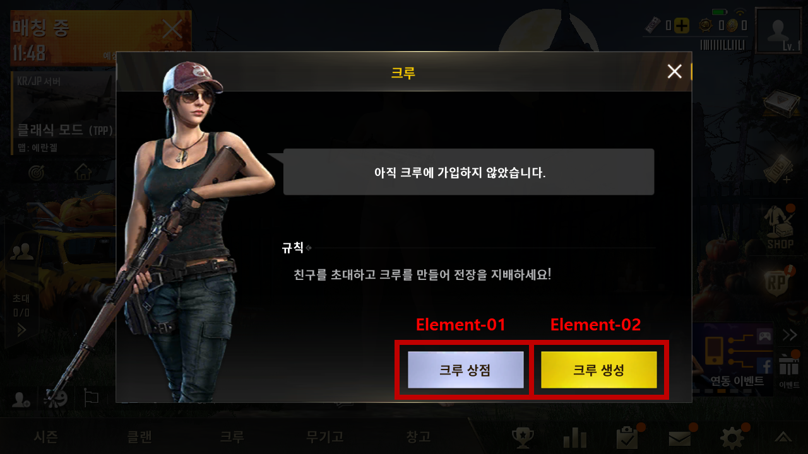
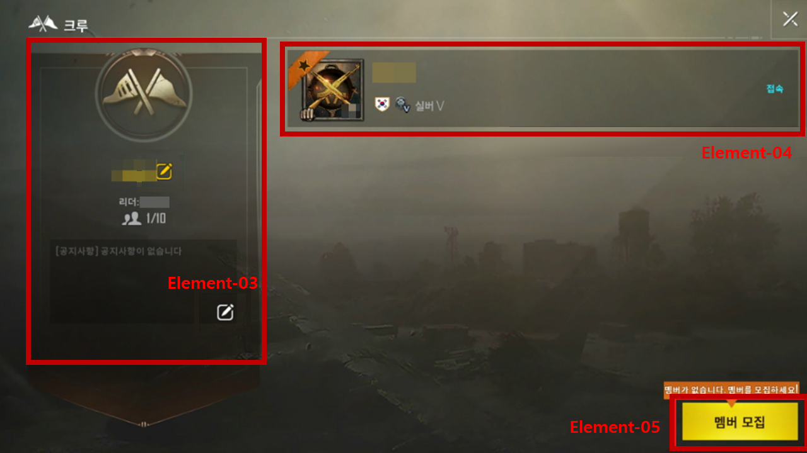

# 정의
  ## 용도
  - 크루를 생성하고 크루 상점을 이용할 수 있는 기능

  ## 기대효과
  - 클랜에 비하여 소규모 인원의 그룹을 생성 가능
  - 크루끼리의 크루전과 이를 통한 크루 코인, 크루 상점을 이용가능
 
 

# 구성도

 
 

# 인터페이스 페이지 세부요소
  ## 배경이미지 (Element-00)
    - 메인화면 위에 팝업형식의 창임
    - 왼쪽에는 여캐릭터의 모습이 있음
  ## 크루 상점 (Element-01)
    - 크루전을 통한 크루 코인으로 구매할 수 있는 상품들
    - 총의 스킨이나 캐릭터 의상부터 커스텀 매치 생성권 등을 판매
  ## 크루 생성 (Element-02)
    - 크루 이름 등을 입력한 후 크루를 생성할 수 있음
  ## 배경이미지 (Element-0a)
    - 흐린 세피아톤으로 그려진 폐허 모습 일러스트
  ## 크루 정보 (Element-03)
    - 크루명과 크루의 리더, 인원, 공지사항을 나타내는 요소
    - 크루명과 공지사항은 크루 리더라면 수정할 수 있음
  ## 크루원 정보 (Element-04)
    - 크루원의 국기, 티어, 접속 여부 등을 표시해줌
    - 본인의 정보를 누르면 크루탈퇴를 선택 가능
  ## 멤버 모집 버튼 (Element-05)
    - 친구 목록에 있는 플레이어 중 크루에 초대할 사람을 선택할 수 있음

  ## [크루상점](./Resource/크루/크루상점.md)
 
 

# 기능흐름
  - 크루 상점
    - 크루 상점 페이지로 이동
    - 해당 페이지에서 크루 코인을 이용해 상품 구매 가능
  - 플레이어 정보 UI
    - 누를 경우 해당 플레이어의 정보를 확인하는 버튼이 생성됨
    - 플레이어 본인을 누르면 크루에서 탈퇴할지를 묻는 버튼이 추가 생성
  - 멤버 모집
    - 이미 친구인 플레이어들 중 크루 멤버로 초대하고 싶은 사람을 초대 가능
    - 크루의 인원 제한은 총 10명임
