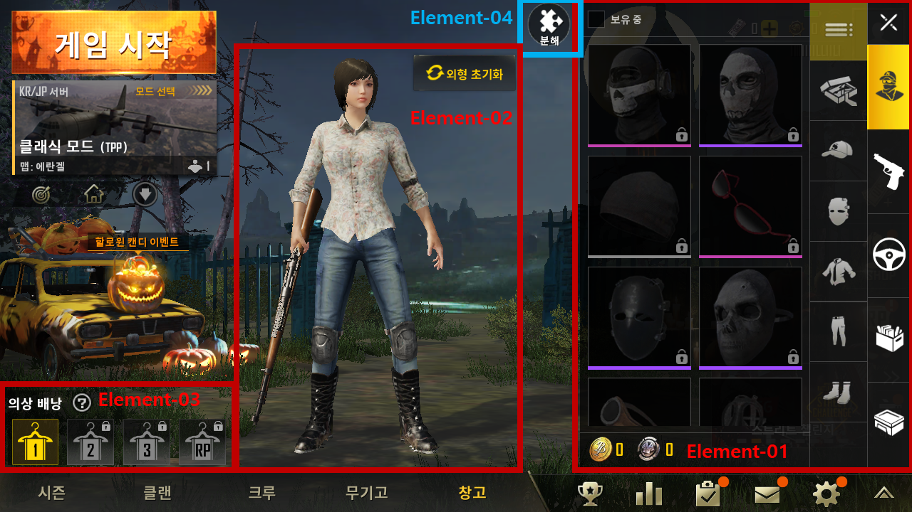

# 정의
  ## 용도
  - 캐릭터의 의상, 총기나 차량 등의 스킨을 정렬해놓음

  ## 기대효과
  - 메인화면에서 캐릭터의 의상을 확인해볼 수 있음
  - 여러 스킨을 적용할 수 있음
 
 

# 구성도

 
 

# 인터페이스 페이지 세부요소
  ## 배경이미지 (Element-00)
    - 메인화면에서 캐릭터만 좌측으로 약간 이동한 상태
  ## 선택 버튼 (Element-01)
    - 스킨을 확인, 적용할 항목을 선택
    - 의상, 무기, 차량 등을 선택 가능
  ## 캐릭터 3D 오브젝트 (Element-02)
    - 의상과 무기를 적용한 캐릭터의 외형을 보여줌
    - 선택한 의상의 착용 부위가 중복될 경우 특정 한 의상만 적용함
  ## 의상 배낭 (Element-03)
    - 의상 배낭을 게임머니 및 캐시로 구매 가능
    - 의상 배낭의 개수만큼 스킨을 저장해둘 수 있음
  ## 분해 버튼 (Element-04)
    - 중복된 스킨을 분해해서 스킨을 만드는 재료로 바꿀 수 있음

  ### 창고 기본 표시 항목
  <table>
    <tr>
      <th colspan=5> 의상
    </tr>
    <tr>
      <td> 본 슬레이어 복면
      <td> 나이트 슬레이어 모자
      <td> 비니
      <td> 선글라스 (레드)
      <td> 발리스틱 마스크
    </tr>
    <tr>
      <td> 데이 슬레이어 가면
      <td> 펑크 안경
      <td> 방독면
      <td> 교복 셔츠 (오픈)
      <td> 만다린 재킷 (블루)
    </tr>
    <tr>
      <td> 꽃무늬 셔츠
      <td> 어반 패딩 재킷
      <td> 줄무늬 티셔츠
      <td> 티셔츠 (레드)
      <td> 더러운 탱크탑 (화이트)
    </tr>
    <tr>
      <td> 더러운 탱크탑 (그레이)
      <td> 긴소매 티셔츠 (블랙)
      <td> 긴소매 티셔츠 (스카이블루)
      <td> 긴소매 줄무늬 티셔츠
      <td> 플리츠 미니 스커트 (블루)
    </tr>
    <tr>
      <td> 핫팬츠 (블루)
      <td> 바지 (블루)
      <td> 피 묻은 전투용 바지
      <td> 카고 바지 (카키)
      <td> 카고 바지 (베이지)
    </tr>
    <tr>
      <td> 카고 바지 (블루)
      <td> 교복 신발
      <td> 하이탑 운동화 (블루)
      <td> 펑크 부츠
      <td> 작업용 부츠
    </tr>
    <tr>
      <th colspan=5> 차량
    </tr>
    <tr>
      <td> 오토바이
      <td> 오토바이 & 사이드카
      <td> Dacia 세단
      <td> 미니버스
      <td> 픽업트럭
    </tr>
    <tr>
      <td> 픽업트럭(하드탑)
      <td> buggy 버기카
      <td> 일반 UAZ 지프
      <td> 부프 UAZ 지프
      <td> UAZ(컨버터블)
    </tr>
    <tr>
      <td> PG117 보트
      <td> 아쿠아레일
      <td> 에어 드랍 UAZ 지프
      <td> 미라도 스포츠카
      <td> 미라도 오픈카
    </tr>
  </table>

 
 

# 기능흐름
  - 스킨 선택 버튼
    - 의상과 무기류는 캐릭터가 착용한 모습을 화면으로 볼 수 있음
    - 이 외의 스킨은 캐릭터가 사라지고 대신 그자리를 스킨 선택창이 차지
  - 캐릭터 3D 오브젝트
    - 드래그를 통해 수평방향으로 360도 회전 가능
    - 외형 초기화 버튼을 누르면 캐릭터 자체의 외형을 소량의 게임머니를 지불한 후 변경 가능
  - 의상 배낭
    - 여러 스킨을 저장해두고 사용 가능
    - 활성화하기 위해서는 일정기간마다 일정량의 게임머니를 사용해야 함
  - 분해
    - 중복된 스킨을 분해해서 자원으로 활용 가능
    - 자원을 사용해서 스킨을 구매 가능
