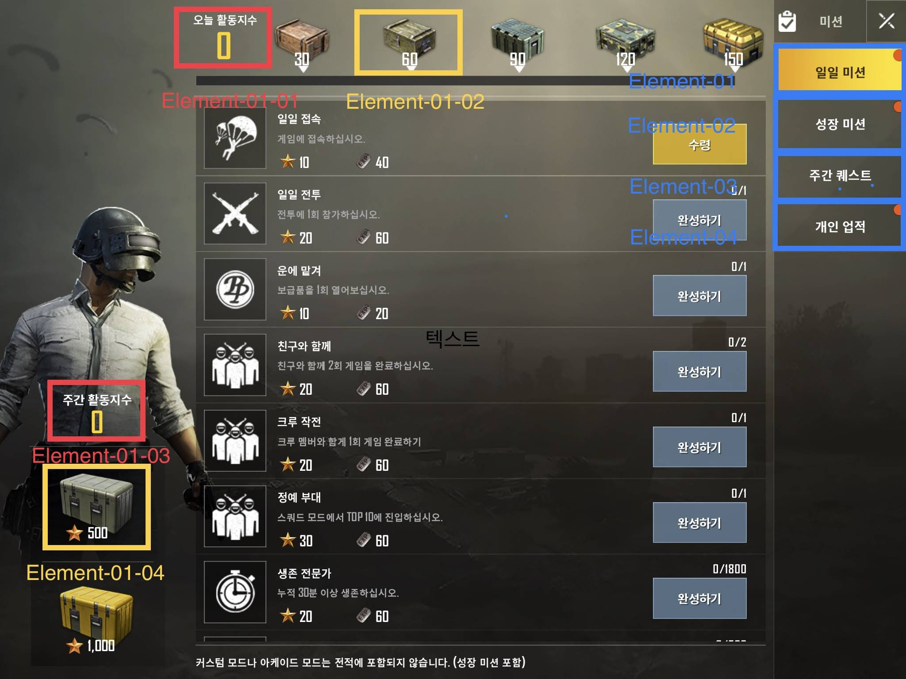
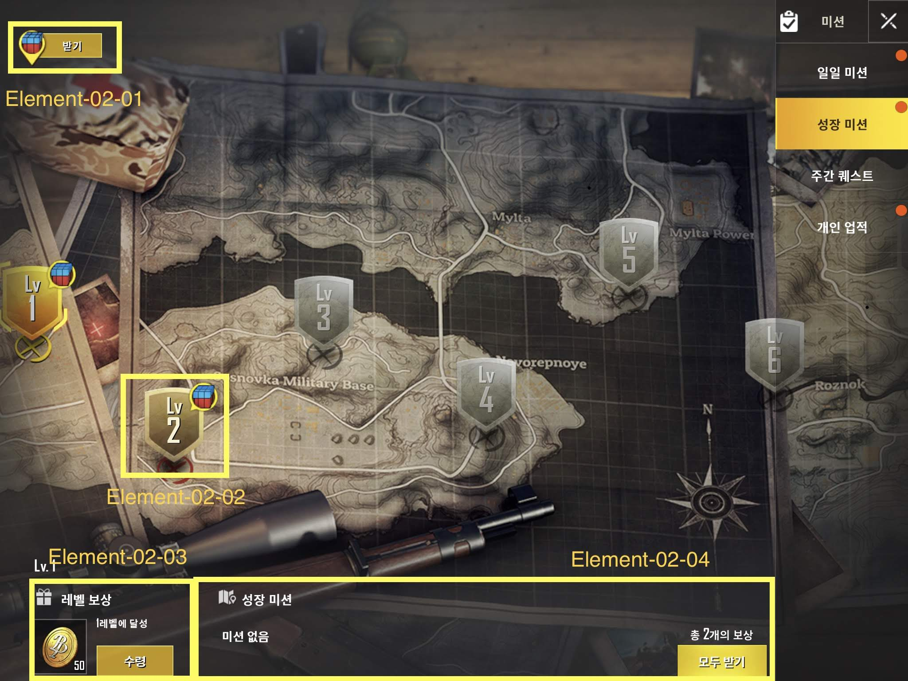

 # 정의
  ## 용도
  - 게이머들이 플레이도중 장단기 목표를 설정할 수 있음
  
  ## 기대효과
  - 게이머들이 미션을 완수하면 성취감을 느낄 수 있음 
  - 미션에 따른 누적 보상을 제공하여 장기접속자 및 충실도 높은 유저 발생 
 
 

# 구성도

 
 

# 인터페이스 페이지 세부요소
  ## 일일 미션 (element-01)
    - 일일 미션 페이지로 이동
  ## 성장 미션 (element-02)
    - 성장 미션 페이지로 이동
  ## 주간퀘스트 (element-03)
    - 주간퀘스트 페이지로 이동
  ## 개인 업적 (element-04)
    - 개인 업적 페이지로 이동
  ## 각 페이지 세부요소 (element-01-01~04, 02-01~04, 03-01~02, 04-01~03)
    - 

  ### 일일 미션
  세부요소번호 | 표시 내용 | 기능
  -------|------|------
  element-01-01| 일일 활동 지수 | 일일 활동 지수를 포인트로 적립
  element-01-02| 일일 활동 지수 보상 | 일일 활동 지수 누적에 따른 보상
  element-01-01| 주간 활동 지수 | 주간 활동 지수를 포인트로 적립
  element-01-02| 주간 활동 지수 보상 | 주간 활동 지수 누적에 따른 보상
 
 

### 성장 미션
  세부요소번호 | 표시 내용 | 기능
  -------|------|------
  element-02-01| 받기 | 클릭하면 보상 수령
  element-02-02| 레벨 | 레벨 분류
  element-02-03| 레벨 보상 | 레벨을 클릭하면 레벨 보상을 확인 가능
  element-02-04| 성장 미션 | 레벨을 클릭하면 성장 미션 확인 가능
  
  ### 주간 퀘스트
  세부요소번호 | 표시 내용 | 기능
  -------|------|------
  element-03-01| 이번 주 진도 | 이번 주 진도 확인 가능
  element-03-02| 매주 획득 가능 보상, 미션 내용| 미션 내용을 확인하고 보상 수령 가능
  
   ### 개인 업적
  세부요소번호 | 표시 내용 | 기능
  -------|------|------
  element-04-01| 업적 입력 | 탭하면 업적 세부 내용 확인 가능
  element-04-02| 업적 포인트, 업적 진행률| 업적 포인트와 업적 총 진행률 확인 가능
  element-04-03| 업적 내용| 탭하면 업적 내용에 따른 분류와 진행도 확인 가능, 하단 과 우측 따로 표시
  
  # 기능흐름
  - 메인화면에서 하단 미션 버튼을 탭
    - 처음 화면은 일일미션
    - 우측 버튼을 통해 각각의 미션 페이지로 이동
