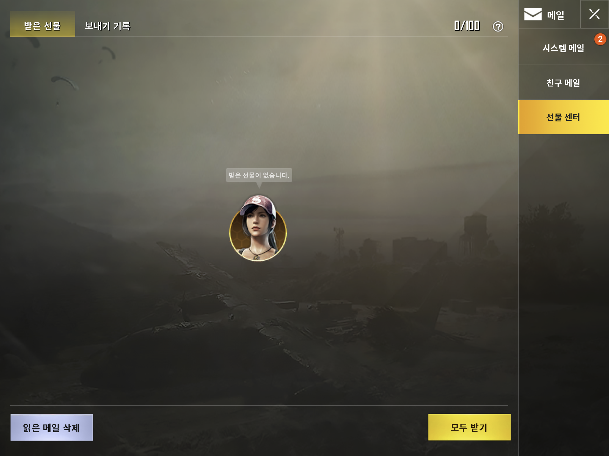

# 정의
  ## 용도
  - 운영진이 게이머들에게 공지사항을 전달하고 게이머들끼리 편지를 보내거나 선물을 보내는 용도
  
  ## 기대효과
  - 운영진과 유저간, 유저와 유저간의 소통이 원활해짐
 
 

# 구성도

 
 

# 인터페이스 페이지 세부요소
  ## 시스템 메일 (element-01)
    - 시스템 메일 페이지로 이동하면 운영진에게서 온 메일을 확인할 수 있다
  ## 친구 메일 (element-02)
    - 친구 메일 페이지로 이동하면 친구간에 메일을 주고 받고 확인할 수 있다
  ## 선물 센터 (element-03)
    - 선물 센터 페이지로 이동하면 주고 받은 선물을 확인할 수 있다
  

  ## 메일 세부사항 (element-01-01~04)
    - 메일 보기, 메일 받기, 메일 삭제, 메일 확인 버튼

  
 
 

# 기능흐름
  - 메인 화면에서 하단 메일 버튼을 탭하여 이동
    - 초기화면은 시스템 메일 화면이고 우측 바를 통해 다른 메일 확인 가능
    - 하단 버튼을 통해 메일 확인 및 삭제 가능
 
 
