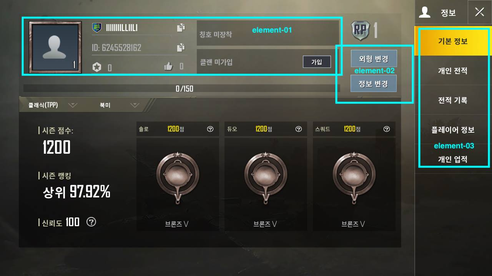
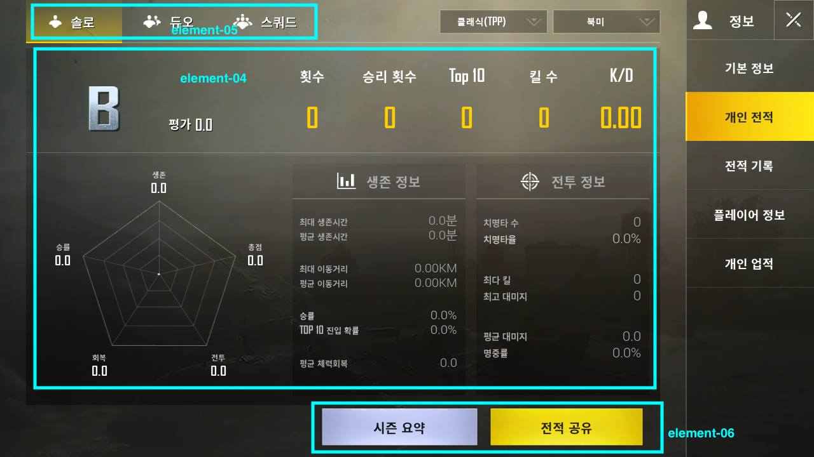
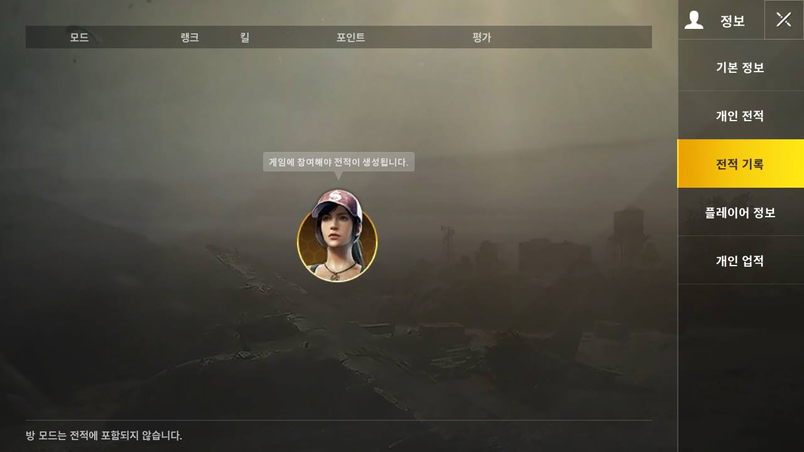
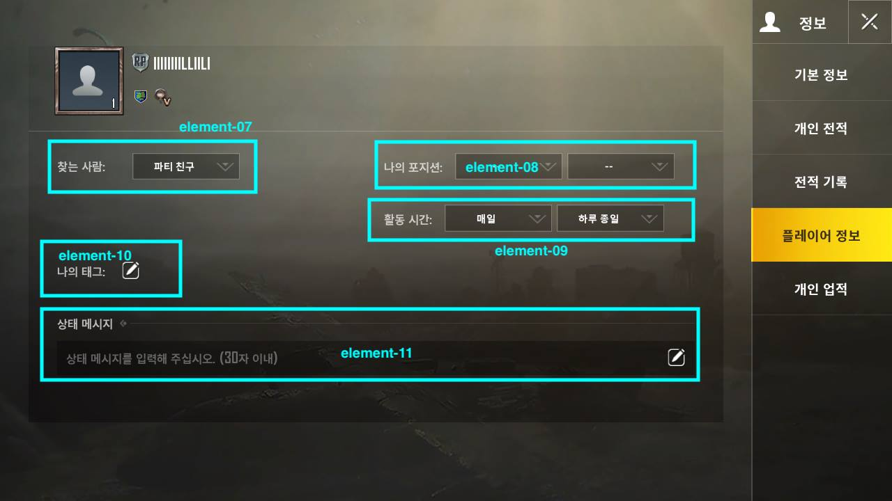
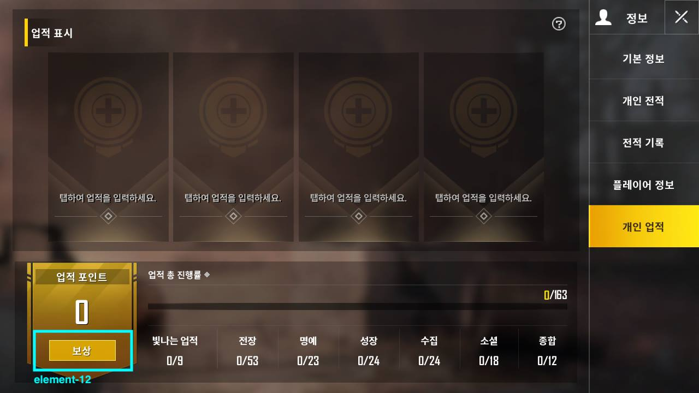

# 정의
  ## 용도
	- 플레이어의 개인정보 정리함
	- 개인정보 수정할 수 있음
	- 게임기록 취득할 수 있음
	- 개인업적 취득할 수 있음
  
  ## 기대효과
	- 플레이어가 쉽게 이해할 수 있는 깔끔한 화면
	- 플레이어 정보 페이지에 소셜기능
 
 

# 구성도

 

 

 

 

 

# 인터페이스 페이지 세부요소
  ## 배경이미지 (element-00)
	- 1-4페이지 | 검은 시티이미지
	- 5페이지 | 업적페이지에 전화면보다 더 화려한 색이 나타남
  ## 페이지1 | 기본정보
	- 플레이어의 기본정보 보여줌 (element-01)
	- 기본정보 수정버튼 (element-02)
	- 리스트 버튼 (element-03)
  ## 페이지2 | 개인전적
	- 전적정보 (element-04)
		- 영어등급
		- 도형으로 더 선명하게 표현함
	- 모드 선택 버튼 (element-05)
	- 시즌요약과 전적공유 버튼 (element-06)
		- 시즌요약 | 플레이어의 데미지,연사력,탄속등 데이터와 랭킹 보여줌
		- 전적공유 | SNS에 연결할 수 있음
  ## 페이지3 | 전적기록
	- 모드, 랭크, 킬, 포인트, 평가 다섯까지 보여줌
  ## 페이지4 | 플레이어정보
	- 소셜기능 있는 페이지
	- 찾는 사람 : 취미 맞는 친구 찾을 수 있음 (element-07)
	- 나의 포지션 : 거주지 같은 친구  찾을 수 있음 (element-08)
	- 활동 시간 : 같이 게임 할 수 있는 친구 찾을 수 있음 (element-09)
	- 나의 태크 : 태크로 자기소개 할 수 있음 (element-10)
	- 상태 메시지 :  간단한 자기소개 작성 할 수 있음 (element-11)
  ## 페이지5 | 개인업적
	- 개인업적 보여줌
	- 업적 포인트 모으고 보상 받을 수 있음 (element-12)

 
 

# 기능흐름
+ 1페이지
	+ 클랜 가입 버튼 : 클랜 가입하고 귀속삼 취득함
	+ 정보, 외형 수정 버튼
	+ 상위 몇% 형식으로 랭킹 보여줌
+ 2페이지
	+ 사소한 정보가 그래프로 보여줌
	+ 전저공유 버튼 : 다른 플레이어를 끌릴 수 있음
+ 4페이지
	+ 게임은 혼자가 아니고, 같이 하는 친구 만날 수 있음
	+ 다양한 플레리어 끌릴 수 있음
	+ 배틀만 아니고, 소셜도 가능!
5페이지
	+ 업적보상 : 성취감 받을 수 있음