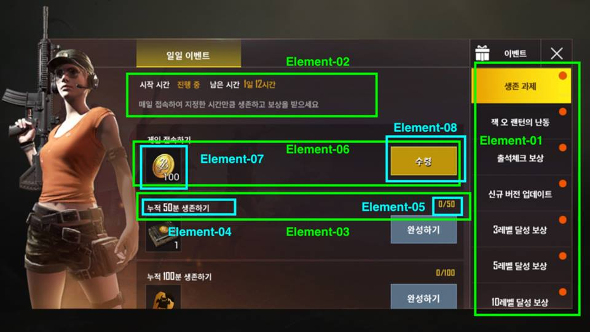

# 정의
  ## 용도
	- 플레이어가 이벤트 페이지에 각 이벤트 소식을 취득할 수 있음
  
  ## 기대효과
	- 이벤트 통해서 플레이어 포상수집하고 싶은 욕심이 자극할 수 있음
	- 매일 이벤트 통해서 일활용 사용자수 늘릴 수 있음
 
 

# 구성도

 
 

# 인터페이스 페이지 세부요소
  ## 배경이미지 (element-00)
	- 전체적으로 검은 게임형상사진
	- 왼쪽에서 플레이어의 개릭터 이미지
  ## 이벤트 선택 버튼 (element-01)
	- 각 이벤트가 리스트로 보여줌
	- 이벤트 페이지 열릴 수 있음
 ## 이벤트 설명 (element-02)
	- 이벤트기간은 시작시간과 남은 시간 두까지로 나타남
	- 끝난날짜로 표현하지 않고, 남은 시간으로 더 직관적인 표현함
	- 간단한 이벤트정의 알려줌
  ## 포상 받은 조건 (element-03)
	- **조건 설명** (element-04)
	- **완성회수/총회수** (element-05)
  ## 포상 (element-06)
	- **포상 설명** (element-07)
	- 포상은 이미지로 보여주고, 오른쪽아래에 숫자로 포상수량 보여줌
	- **수령버튼** (element-08)

 
 

# 기능흐름
- 오른쪽 이벤트 리스트
    - 미열람메시지가 있는 경우 오른쪽 빨간 점으로 표시함
- 이벤트 리스트 순서
    - 기간 특별이벤트가 가장 위에 있음
    - 포상조건 난이도에 따르고 정렬함
- 이벤트 기한
    - 끝난날짜로 표현하지 않고, 남은 시간으로 더 직관적인 표현함
