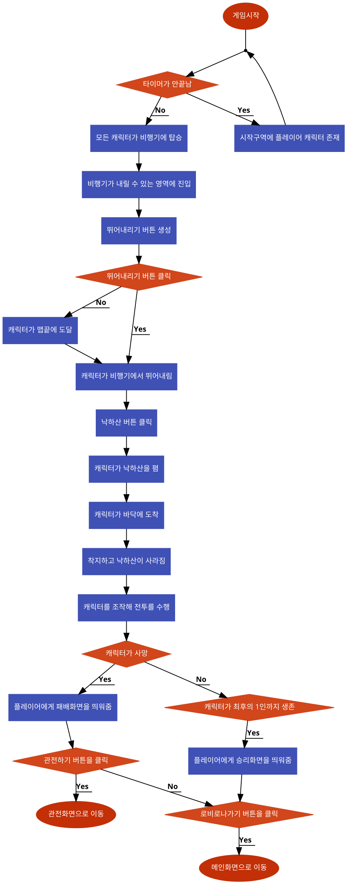

# 시스템 정의
  - 게임을 플레이하는 기본적인 방식
  - 게이머가 캐릭터를 조작해 오픈월드맵을 이동하며 최후의 승자가 될때 까지 전투를 수행
  
# 시스템 설명
  - 외딴 섬에서 총 100명의 플레이어가 다양한 무기를 이용한 전투를 통해 최후의 1명 또는 1팀을 가려냄
  - 점점 좁혀져 오는 경기 구역 내에서, 플레이어는 랜덤하게 배치된 무기, 차량 및 소모품을 획득해 전투를 수행
 
 

# 기본실행순서

번호 | 사용자 행위 | 화면상의 결과
:-------: | :-------: | :-------:
1 | 게임시작 | 플레이어 캐릭터가 시작구역에 생성
2 | 타이머가 끝남 | 모든캐릭터가 비행기에 탑승
3 | 내릴 수 있는 영역에 진입 | 뛰어내리기 버튼이 생성 
4-1 | 뛰어내리기 버튼 클릭 | 캐릭터가 비행기에서 뛰어내림
4-2 | 안뛰어내리고 맵끝에 도달 | 자동으로 비행기에서 뛰어내림 
5 | 낙하산 버튼 클릭 | 캐릭터가 낙하산을 폄
6 | 캐릭터가 바닥에 도착 | 착지하고 낙하산이 사라짐
7 | 캐릭터를 조작 | 캐릭터를 조작해 전투를 수행
8-1 | 캐릭터가 최후의 1인(팀)까지 생존 | 플레이어에게 승리화면을 띄워줌
8-2 | 캐릭터가 사망 | 플레이어에게 패배화면을 띄워줌
9-1 | 승리화면의 로비로 나가기 버튼을 클릭 | 메인화면으로 이동
9-2-1 | 패배화면의 로비로 나가기 버튼을 클릭 | 메인화면으로 이동
9-2-2 | 패배화면의 관전하기 버튼을 클릭 | 관전화면으로 이동
 
 