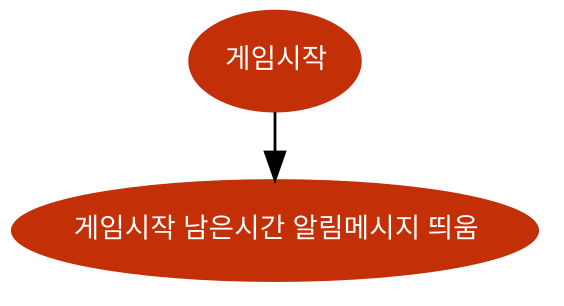
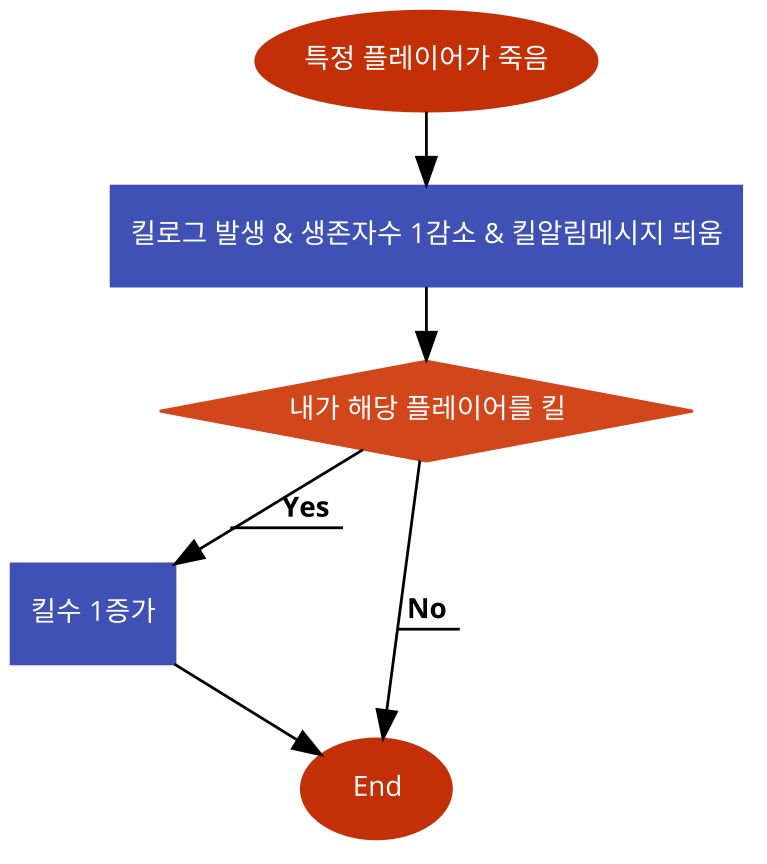
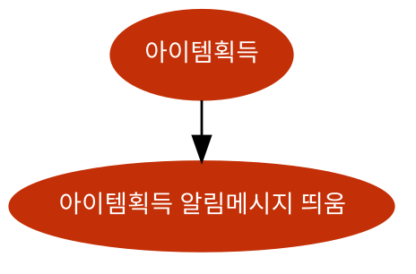
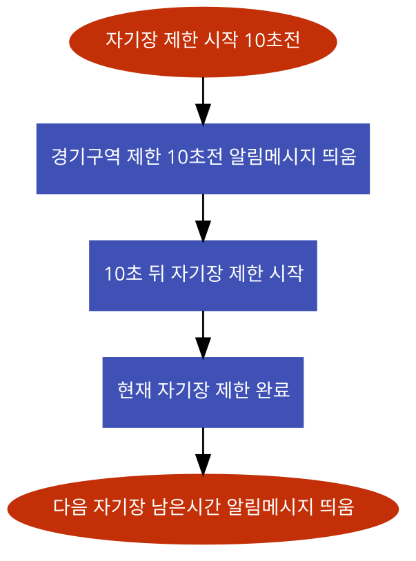

# 시스템 정의
  - 게임 플레이를 위한 정보들을 제공하는 시스템
  
# 시스템 설명
  - 생존자수 및 킬수
    - 현재 살아있는 생존자수와 플레이어의 킬수를 알림
    - 플레이어들 중 한명이 죽으면 생존자수를 1감소시킴
    - 자신의 캐릭터가 상대방을 죽이면 킬수를 1증가 시킴
  - 킬로그
    - 모든 플레이어 사망에 대한 정보를 알리는 로그
    - 게임 플레이어 중 한명이 사망하면 킬로그가 발생
    - 죽인플레이어의 ID와 죽은플레이어의 ID를 공지
  - 알림메시지
    - 주요 사항들을 유저에게 알려주는 메시지
    - 게임시작 전 메시지
        - 게임시작까지 남은시간 k초
        - k는 60에서 시작해서 1초마다 1씩 감소
    - 아이템을 주웠을때 메시지
        - (아이템이름)을(를) 주웠습니다
    - 자신의 캐릭터가 다른 플레이어를 죽였을때 메시지
        - 당신이 (무기이름)을(를) 사용하여 (죽인플레이어ID)을(를) 처치했습니다.
    - 자기장 관련 메시지
        - 경기구역이 제한됩니다. x분k초남았습니다!
        - 경기구역 제한되기 10초 전
 
 

# 기본실행순서
## 게임시작

번호 | 사용자 행위 | 화면상의 결과
:-------: | :-------: | :-------:
1 | 게임시작 | 게임시작 남은시간 알림메시지 띄움

## 킬상황

번호 | 사용자 행위 | 화면상의 결과
:-------: | :-------: | :-------:
1 | 특정 플레이어가 죽음 | 킬로그 발생 생존자수 1감소 킬알림메시지 띄움
2 | 내가 해당 플레이어를 킬했으면 | 킬수 1증가

## 아이템획득

번호 | 사용자 행위 | 화면상의 결과
:-------: | :-------: | :-------:
1 | 아이템 획득 | 아이템 획득 알림메시지 띄움 

## 자기장상황

번호 | 사용자 행위 | 화면상의 결과
:-------: | :-------: | :-------:
1 | 자기장 제한 시작 10초전 | 경기구역 제한 10초전 알림메시지 띄움
2 | 현재 자기장 제한 완료 | 다음 자기장 남은시간 알림메시지 띄움

 
 